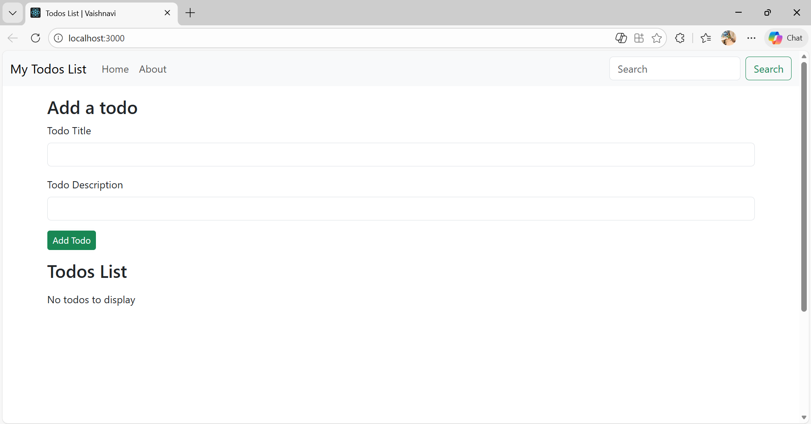
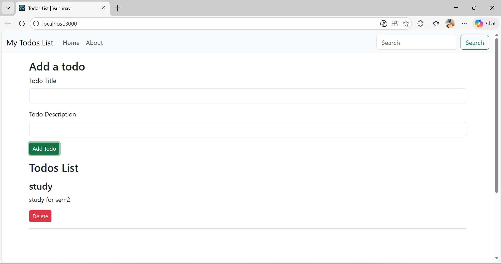

# ✅ Todo Task Management App

## Overview

A simple task management app built using React that allows users to manage daily tasks efficiently.

## Problem It Solves

Helps users organize tasks with add, update, and delete functionality.

## Tech Stack

- React.js
- JavaScript
- CSS

## Screenshots

### Default Todo list

### Task Added

### Task Deleted

## Features

- Add new tasks
- Delete completed tasks
- Clean and simple UI
- Component-based structure

## What I Learned

- State management in React
- Passing props between components
- Structuring a React project
- Writing cleaner commit messages

## How to Run Locally

1. Clone the repository
2. Run `npm install`
3. Run `npm start`
